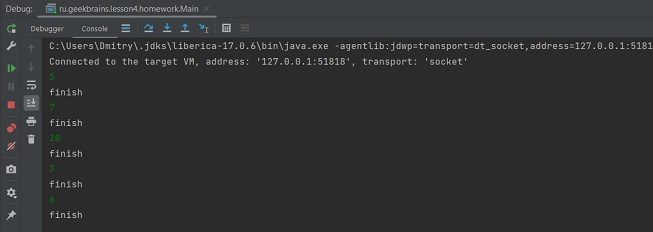
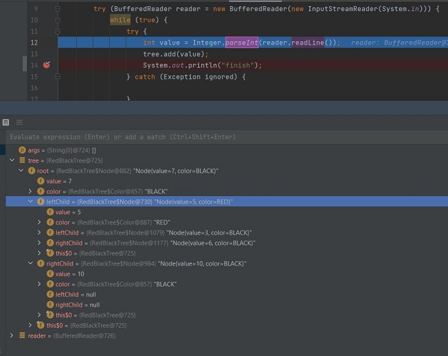

## Урок 4

### HW4

Реализовать:

1. Метод добавления новых элементов.

2. Балансировку:
    
   2.1 левый малый поворот   
   2.2 правый малый поворот  
   2.3 смена цвета

#### Проход по левостороннему красно-черному дереву в дебаггере

При добавлении новых элементов

Выполняется ребалансировка

